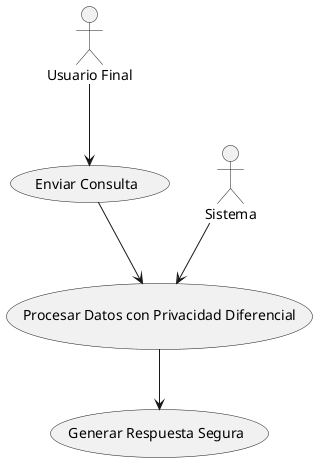
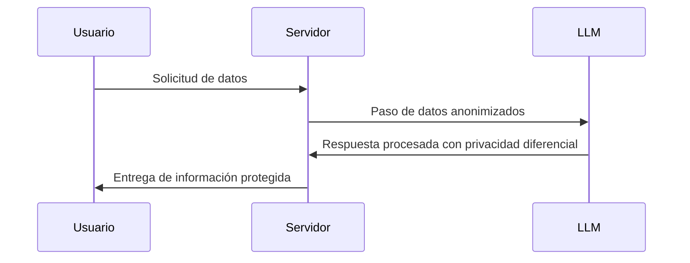
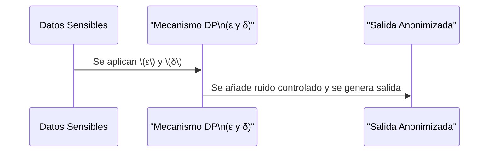
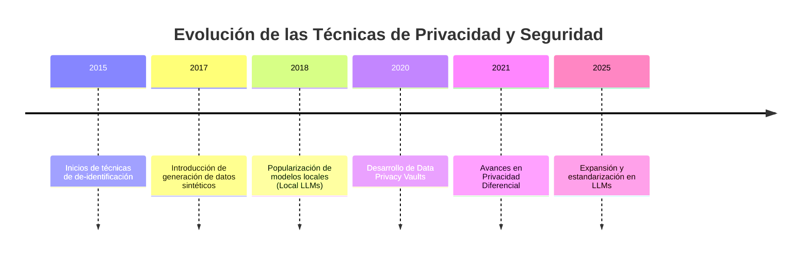

# Protección de Privacidad y Seguridad en Modelos de Lenguaje (LLMs)- Enfoque investigativo "Técnica Differential Privacy "

## Differential Privacy - Andres Camilo Buitrago Gómez

## Motivación
El uso creciente de Modelos de Lenguaje (LLMs) en aplicaciones del mundo real trae consigo importantes desafíos relacionados con la privacidad y seguridad de los datos. Este curso tiene como propósito proporcionar una visión integral de las técnicas más relevantes para mitigar riesgos y garantizar la protección de información sensible. Con ejemplos prácticos, diagramas y referencias a herramientas reconocidas, esta guía es una valiosa base para aprendices, desarrolladores, investigadores y empresas que trabajan en el ámbito de los LLMs.

---

## Tabla de Contenidos
- [Protección de Privacidad y Seguridad en Modelos de Lenguaje (LLMs)](#protección-de-privacidad-y-seguridad-en-modelos-de-lenguaje-llms)
  - [Motivación](#motivación)
  - [Tabla de Contenidos](#tabla-de-contenidos)
  - [Introducción](#introducción)
  - [Objetivos del Curso](#objetivos-del-curso)
  - [Procesamiento Técnico de los LLMs](#procesamiento-técnico-de-los-llms)
    - [¿Cómo funcionan los LLMs?](#cómo-funcionan-los-llms)
  - [Diagramas Fundamentales](#diagramas-fundamentales)
    - [Caso de Uso](#caso-de-uso)
    - [Diagrama de Secuencia](#diagrama-de-secuencia)
  - [Técnicas para Proteger la Privacidad y Seguridad](#técnicas-para-proteger-la-privacidad-y-seguridad)
    - [Data Privacy Vaults](#data-privacy-vaults)
    - [De-identification](#de-identification)
    - [Synthetic Data Generation](#synthetic-data-generation)
    - [Local LLMs](#local-llms)
    - [Copyright y LLMs](#copyright-y-llms)
    - [Differential Privacy](#differential-privacy)
  - [Parámetros de Privacidad en Differential Privacy (DP)](#parámetros-de-privacidad-en-differential-privacy-dp)
    - [Definición Matemática y Conceptual](#definición-matemática-y-conceptual)
    - [Ejemplo en un Contexto Real](#ejemplo-en-un-contexto-real)
    - [Visualización del Impacto de \(ε\) y \(δ\)](#visualización-del-impacto-de-ε-y-δ)
  - [Aporte Investigativo Profesional: Casos de Uso y Arquitectura de Differential Privacy en LLMs](#aporte-investigativo-profesional-casos-de-uso-y-arquitectura-de-differential-privacy-en-llms)
    - [Casos de Uso Avanzados](#casos-de-uso-avanzados)
    - [Ejemplos Textuales y Visuales](#ejemplos-textuales-y-visuales)
    - [Diagrama de Arquitectura de Differential Privacy](#diagrama-de-arquitectura-de-differential-privacy)
  - [Evolución de las Técnicas de Privacidad y Seguridad](#evolución-de-las-técnicas-de-privacidad-y-seguridad)
    - [Gráfico de Evolución](#gráfico-de-evolución)
  - [Empresas y Herramientas Relevantes](#empresas-y-herramientas-relevantes)
  - [Conclusión](#conclusión)
  - [Contenido Curado](#contenido-curado)

---

## Introducción
Los Modelos de Lenguaje (LLMs) representan un hito en la inteligencia artificial, facilitando aplicaciones que van desde la asistencia virtual hasta la generación automatizada de contenidos. Sin embargo, su uso intensivo plantea retos cruciales en términos de privacidad de datos y seguridad. Este curso se centra en explorar estrategias avanzadas, entre ellas la **privacidad diferencial**, para garantizar un desarrollo ético y responsable de estas tecnologías.

---

## Objetivos del Curso
1. Comprender las principales técnicas para proteger la privacidad y seguridad en LLMs.
2. Explorar casos de uso reales que muestren la aplicación práctica de estas técnicas.
3. Identificar herramientas y empresas líderes que implementan medidas de protección de datos.
4. Fomentar buenas prácticas en el desarrollo y entrenamiento de modelos de lenguaje.

---

## Procesamiento Técnico de los LLMs

### ¿Cómo funcionan los LLMs?
Los Modelos de Lenguaje (LLMs), como GPT, operan utilizando arquitecturas avanzadas basadas en redes neuronales profundas. En particular, la arquitectura **Transformer** es fundamental para su funcionamiento. Los pasos principales incluyen:

1. **Representación de Datos con Embeddings:**  
   Conversión de datos textuales en representaciones numéricas (por ejemplo, Word2Vec, GloVe).

2. **Mecanismo de Atención:**  
   Permite que el modelo dé prioridad a ciertos elementos del texto, identificando relaciones contextuales.

3. **Entrenamiento por Prealimentación:**  
   Ajuste de parámetros mediante algoritmos de optimización para minimizar errores.

4. **Inferencia y Generación:**  
   Uso del modelo entrenado para generar texto coherente y contextualizado.

---

## Diagramas Fundamentales

### Caso de Uso


### Diagrama de Secuencia


---

## Técnicas para Proteger la Privacidad y Seguridad
### **Data Privacy Vaults**
Sistemas que almacenan datos sensibles de forma segura, utilizados por instituciones bancarias y financieras para preservar la privacidad durante el entrenamiento de LLMs.

### **De-identification**
Método para eliminar o modificar información identificable en los datos, permitiendo su uso sin comprometer la privacidad individual.

### **Synthetic Data Generation**
Generación de datos artificiales que conservan las propiedades estadísticas de los datos reales, útil para entrenar modelos sin exponer información sensible.

### **Local LLMs**
Implementación de modelos en entornos locales que evitan el envío de datos sensibles a servidores externos.

### **Copyright y LLMs**
Estrategias para garantizar el cumplimiento de derechos de autor durante el proceso de entrenamiento mediante el uso de datos públicos o con licencias adecuadas.

### **Differential Privacy**
**La privacidad diferencial (DP)** es un marco matemático diseñado para proteger la privacidad de los datos individuales mediante la adición de ruido controlado. Esto permite que los análisis y modelos generados mantengan la utilidad estadística sin revelar información específica de individuos.

- **Conceptos Clave:**

	- **Ruido Controlado:** Perturbación introducida en los datos que preserva patrones generales.

	- **Privacidad Formal:** Garantía de que la inclusión o exclusión de un individuo no afecta significativamente el resultado.

	- **Medidas de Preservación:** Técnicas que aseguran la no filtración de datos sensibles ante posibles ataques.

- **Caso de Uso Básico:** Un LLM en el sector salud analiza registros médicos anonimizados, permitiendo obtener insights sin comprometer la privacidad de los pacientes.


---

### Parámetros de Privacidad en Differential Privacy (DP)

## **Definición Matemática y Conceptual**
**Differential Privacy se define de la siguiente forma:**

Sea 𝑀 un mecanismo aleatorio que opera sobre un conjunto de datos 𝐷. Se dice que 𝑀 satisface (𝜀,𝛿)-**Differential Privacy** si para cualquier conjunto de salida 𝑆 y para cualquier par de conjuntos de datos 𝐷 y 𝐷′ que difieren en solo una entrada:

				Pr[M(D)∈S]≤e^ε * Pr[M(D′)∈S]+δ

Donde:

- 𝜀(Epsilon):
Controla el nivel de privacidad. Un valor pequeño de 𝜀 implica que la salida del mecanismo no cambia significativamente con la modificación de un solo dato, asegurando alta privacidad.

- 𝛿(Delta):
Representa la probabilidad de que la garantía de privacidad diferencial falle. Valores muy pequeños de 𝛿 reducen la posibilidad de exposición de información sensible.

## **Ejemplo en un Contexto Real**
Imaginemos entrenar un LLM para generar respuestas basadas en historiales médicos, protegiendo la identidad de los pacientes.
- Usando 𝜀 = 0.1 y 𝛿 = 10^−5, se garantiza que la diferencia en la salida del modelo, al incluir o excluir un historial, sea mínima.

- Si se aumenta 𝜀 a 3, se obtiene mayor precisión, pero a costa de un mayor riesgo de exponer información individual.

- Reducir 𝛿 a 10^-8 minimiza aún más la probabilidad de fallo en la privacidad.

### **Visualización del Impacto de (ε) y (δ)**
A continuación, se muestra un diagrama que ilustra la secuencia de interacción entre la entrada, los parámetros de privacidad y la salida del sistema:



---


# Aporte Investigativo Profesional: Casos de Uso y Arquitectura de "Differential Privacy" en LLMs
### **Casos de Uso Avanzados**
1. **Salud y Medicina:**

	- **Aplicación:** Sistemas de diagnóstico que utilizan registros médicos anonimizados para entrenar modelos predictivos.

	- **Beneficio:** Minimiza el riesgo de exposición de datos personales, cumpliendo con normativas como HIPAA.

2. **Sistemas de Recomendación:**

	- **Aplicación:** Plataformas de streaming o e-commerce que aplican privacidad diferencial para analizar patrones de consumo sin identificar a usuarios individuales.

	- **Beneficio:** Mejora la personalización manteniendo la confidencialidad de los hábitos de los usuarios.

3. **Análisis de Redes Sociales:**

	- **Aplicación:** Herramientas de análisis de sentimiento que operan sobre datos agregados, garantizando que los resultados no permitan la identificación de usuarios.

	- **Beneficio:** Permite insights valiosos en marketing y opinión pública sin vulnerar la privacidad.

	### **Ejemplos Textuales y Visuales**
	**Ejemplo Textual:**
	Un centro de salud utiliza un LLM entrenado con registros médicos protegidos mediante privacidad diferencial para predecir el riesgo de enfermedades cardiovasculares. El modelo añade ruido a los datos de entrada, garantizando que la información de cada paciente se mantenga anónima, mientras se extraen tendencias y patrones generales que ayudan en la prevención y tratamiento.

	**Ejemplo Visual:**
	Se puede imaginar una gráfica donde los datos brutos se representan en una distribución, y al aplicar el mecanismo de privacidad diferencial, la distribución "se difumina" para evitar picos que puedan identificar a individuos. Este enfoque se refleja en dashboards de monitoreo de datos sanitarios, donde se muestran tendencias sin exponer datos sensibles.

	### **Diagrama de Arquitectura de Differential Privacy**
	A continuación se muestra un diagrama en Mermaid que ilustra cómo se integra el mecanismo de privacidad diferencial en el flujo de entrenamiento de un LLM:


	```mermaid
	flowchart TD
		%% Subgrafo para el mecanismo de Privacidad Diferencial (DP)
		subgraph Mecanismo_DP [Mecanismo DP]
		  B[Aplicación del Mecanismo DP]
		  B1[Adición de Ruido: ε y δ]
		  B2[Control de Sensibilidad]
		  B --> B1
		  B1 --> B2
		end

		%% Flujo principal
		A[Datos Sensibles Originales] --> B
		B2 --> C[Datos Anonimizados con Ruido]
		C --> D[Preprocesamiento y Validación]
		D --> E[Entrenamiento del LLM]
		E --> F[Modelo de Lenguaje con Privacidad Garantizada]
		F --> G[Generación de Respuestas Seguras]

		%% Estilos para mejorar la apariencia
		style A fill:#FFFAE6,stroke:#333,stroke-width:2px,rounded
		style B fill:#DCE8F6,stroke:#333,stroke-width:2px,rounded
		style B1 fill:#D6EAD7,stroke:#333,stroke-width:2px,rounded
		style B2 fill:#F3E6F8,stroke:#333,stroke-width:2px,rounded
		style C fill:#E6F7FF,stroke:#333,stroke-width:2px,rounded
		style D fill:#FFF3E0,stroke:#333,stroke-width:2px,rounded
		style E fill:#FCD5D5,stroke:#333,stroke-width:2px,rounded
		style F fill:#FFE5B4,stroke:#333,stroke-width:2px,rounded
		style G fill:#D4EDDA,stroke:#333,stroke-width:2px,rounded
	```	
	
	**Descripción:**

	1. Datos Sensibles Originales: Se recolectan datos sin procesar que contienen información privada.

	2. Aplicación del Mecanismo DP: Se introduce ruido controlado (configurado mediante parámetros como ε y δ) para garantizar la privacidad.

	3. Datos Anonimizados con Ruido: Los datos transformados retienen patrones estadísticos sin revelar detalles individuales.

	4. Preprocesamiento y Validación: Se realizan tareas de limpieza y validación antes de la etapa de entrenamiento.

	5. Entrenamiento del LLM: El modelo se entrena con los datos anonimizados.

	6. Modelo de Lenguaje con Privacidad Garantizada: El LLM resultante puede generar respuestas sin comprometer la privacidad.

	7. Generación de Respuestas Seguras: Durante la inferencia, el modelo sigue utilizando técnicas de privacidad para proteger la información.

---

## Evolución de las Técnicas de Privacidad y Seguridad

### Gráfico de Evolución


---


## Empresas y Herramientas Relevantes
1. **Google:**

	- *Herramientas:* RAPPOR, TensorFlow Privacy

	- *Uso:* Implementación de mecanismos de privacidad en análisis masivos de datos.

2. **Apple:**

	- *Aplicación:* Uso de privacidad diferencial en sugerencias predictivas y análisis de uso.

3. **OpenAI:**

	- *Enfoque:* Investigación en técnicas de protección de datos en modelos de lenguaje como ChatGPT.

4. **Microsoft:**

	- *Contribución:* Integración de frameworks de privacidad diferencial en herramientas de análisis y entrenamiento de modelos.

5. **PyTorch & Opacus:**

	- *Herramienta:* Biblioteca para implementar privacidad diferencial en modelos basados en PyTorch.

---

## Conclusión
- La integración de técnicas avanzadas, como la privacidad diferencial, es fundamental para garantizar el desarrollo ético y seguro de los LLMs. A través de la aplicación de mecanismos que añaden ruido controlado y preservan la utilidad estadística, es posible entrenar modelos que respeten la privacidad individual sin sacrificar el rendimiento. Las aplicaciones en sectores tan críticos como la salud, el comercio electrónico y el análisis de redes sociales demuestran el potencial de estas técnicas para transformar el manejo de datos sensibles en entornos reales.

---

## Contenido Curado
* [Fine-Tuning Large Language Models with User-Level Differential Privacy](https://arxiv.org/abs/2407.07737)

* [Privately Fine-Tuning Large Language Models with Differential Privacy](https://arxiv.org/abs/2210.15042)

* [Privacy-Preserving Techniques in Generative AI](https://www.mdpi.com/2078-2489/15/11/697)

---